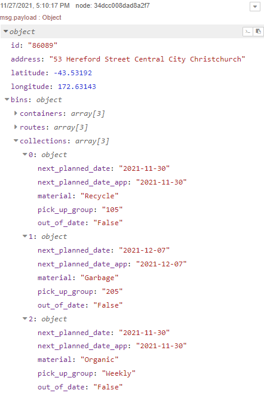
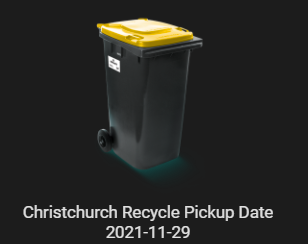

# Christchurch Bins integration with Home Assistant

Since the creation of the v1 of this CCC (Christchurch City Council) have taken down or blocked the endpoint where the api calls used to be made.

The mobile app still can give the information but needs a bit of work to be able to run a man-in-the-middle to get the endpoint and authorization.

## Prerequisites

Android

[Node.js](https://nodejs.org/en/download/) (14+) and [Java](https://www.oracle.com/technetwork/java/javase/downloads/index.html) (8+) for apk-mitm

[apk-mitm](https://github.com/shroudedcode/apk-mitm) - A CLI application that automatically prepares Android APK files for HTTPS inspection

[mitmproxy](https://mitmproxy.org/)  - a free and open source interactive HTTPS proxy

## Prepare Android APK file for HTTPS inspection

Download the APK from the play store, there are a few methods out there to do so. Download the architecture that is your device.

run apk-mitm over that apk:

```
$ apk-mitm <path-to-apk>
```

Download the new apk file to your device you want to Man-in-the-middle, trust the source and install the apk.

## Using mitmproxy on Android to see requests

Run an instance of mitmproxy and setup your android device to use mitmproxy.

Setup the Christchurch Bin app as you normally would and you will see a GET request with your client_id and client_secret to a url like:

```
https://ccc-data-citizen-api-v1-prod.au-s1.cloudhub.io/api/v1/properties/<propertyid>
```

## Using your client_id, client_secret & URL in Home Assistant

That URL will generate a JSON output of that property



We need to add the scraping from the API into the configuration.yaml and some logic to get the bin of the week for lovelace

```yaml
sensor:
  - platform: rest
    resource: https://ccc-data-citizen-api-v1-prod.au-s1.cloudhub.io/api/v1/properties/<propertyid>
    method: GET
    headers:
      client_id: '<client_id>'
      client_secret: '<client_secret>'
    name: "Christchurch Bin Type"
    value_template: >
      
      
      {{ value_json}}
    scan_interval: 43200
  - platform: rest
    resource: https://ccc-data-citizen-api-v1-prod.au-s1.cloudhub.io/api/v1/properties/<propertyid>
    method: GET
    headers:
      client_id: '<client_id>'
      client_secret: '<client_secret>'
    name: "Christchurch Bin Date"
    value_template: >
      
      {{ value_json.next_planned_date}}
    scan_interval: 43200
```

Then add a custom card to lovelace:

```
type: vertical-stack
cards:
  - type: custom:button-card
    entity: sensor.christchurch_bin_type
    show_entity_picture: true
    state:
      - entity_picture: https://ccc.govt.nz/resources/ccc-kerbside/client/images/yellowbin.png
        value: Recycle
      - entity_picture: https://ccc.govt.nz/resources/ccc-kerbside/client/images/redbin.png
        value: Garbage
  - type: entity
    entity: sensor.christchurch_bin_date
    state_color: false
    icon: mdi:delete-clock
```

